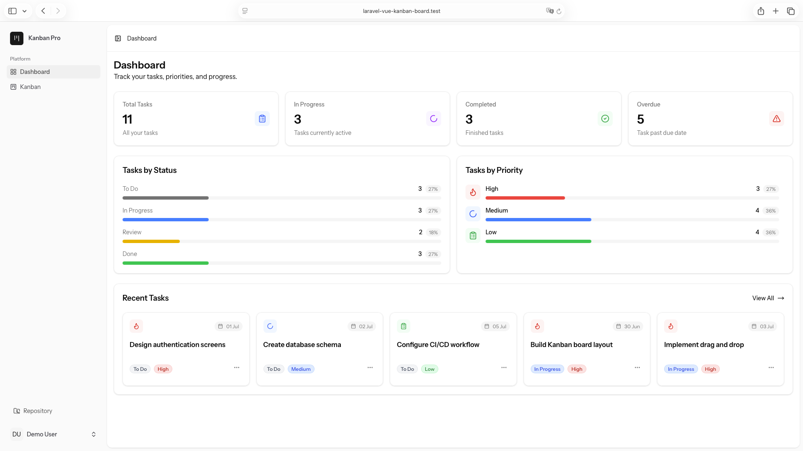
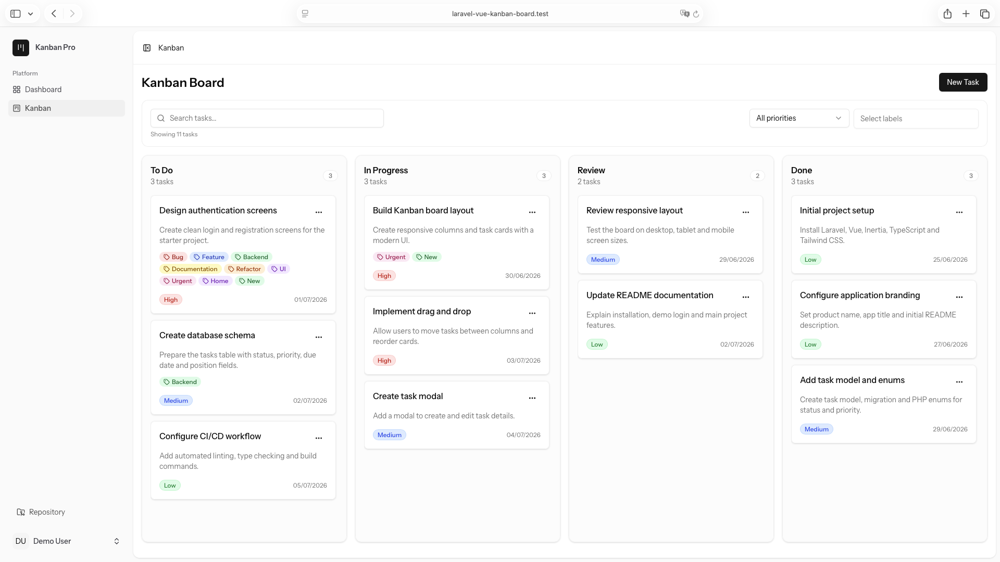
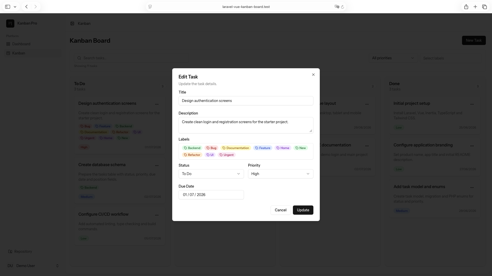

# Laravel Vue Kanban Board

Modern Kanban Board built with Laravel 13, Vue 3, Inertia.js and TypeScript.

Designed with clean architecture, reusable components and modern Laravel best practices.

> 🚀 A commercial Laravel & Vue Kanban Board built for modern project management applications.

## 📌 Project Overview

| Feature | Status |
|----------|--------|
| Laravel | 13 |
| Vue | 3 |
| PHP | 8.4 |
| License | Commercial |
| Demo | Coming Soon |

> [!NOTE]
> This repository is a showcase of the project.
>
> The full source code is distributed under a commercial license and is not included in this repository.

## ✨ Features

### 📊 Dashboard

- Dashboard overview
- Task statistics
- Responsive layout

### 📋 Kanban Board

- Drag & Drop
- Multiple task statuses
- Task priorities
- Due dates
- Labels
- Search tasks
- Filter by priority
- Filter by labels
- Keyboard shortcuts
- Empty states

### ✅ Tasks

- Create, edit and delete tasks
- Rich task details
- Task descriptions
- Reusable dialogs
- Form validation

### 🎨 User Experience

- Responsive design
- Clean interface
- Dark mode *(coming soon)*

### 👨‍💻 Developer Experience

- Laravel 13
- Vue 3
- TypeScript
- Inertia.js
- Shadcn Vue
- Tailwind CSS
- Feature Tests
- Policies
- Form Requests
- Seeders
- Factories

## 📸 Screenshots

### Landing Page

---

### Application

| Dashboard | Kanban Board |
|------------|--------------|
|  |  |

| Task Details | Label Management |
|--------------|------------------|
|  |  |

## 🛠 Tech Stack

- Laravel 13
- PHP 8.4
- Vue 3
- TypeScript
- Inertia.js
- Tailwind CSS
- Shadcn Vue
- SortableJS
- Pest

## 🗺 Roadmap

- [ ] Projects
- [ ] Comments
- [ ] Checklists
- [ ] File Attachments
- [ ] Notifications
- [ ] Dashboard Charts
- [ ] Team Management
- [ ] Calendar View

## 🛒 Purchase

The full source code will be available as a commercial product.

Stay tuned for the official release.

## 📄 License

This repository is provided for showcase purposes only.

The source code is distributed under a commercial license and is not included in this repository.

