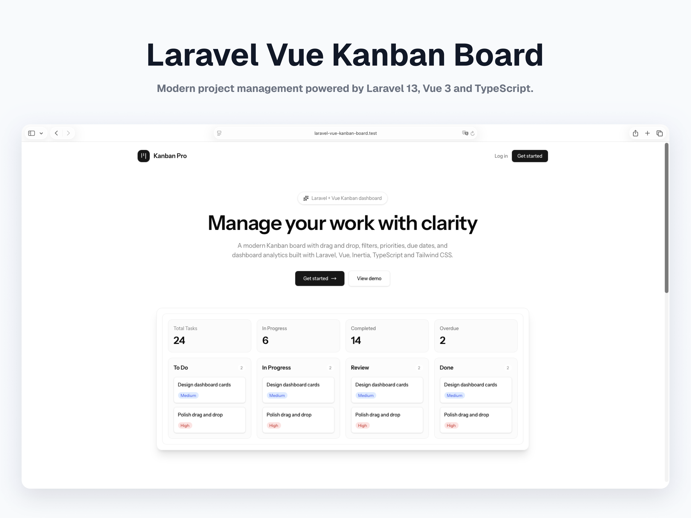
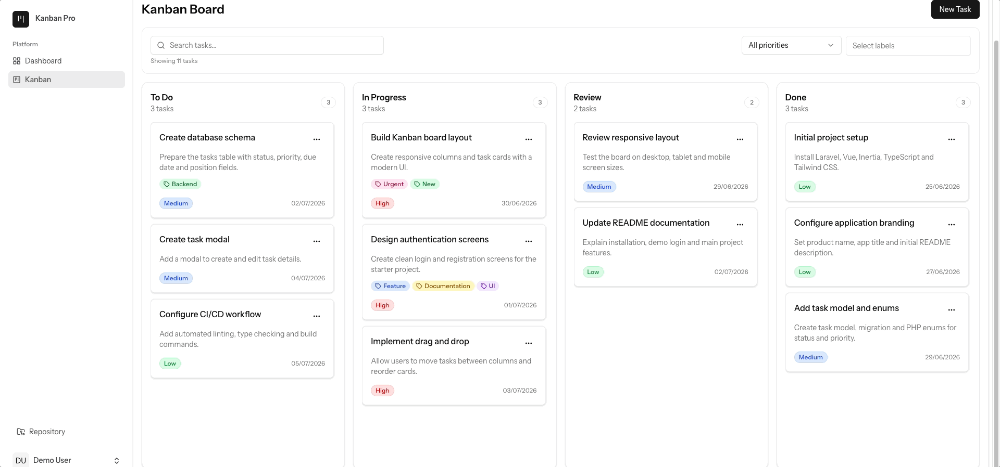
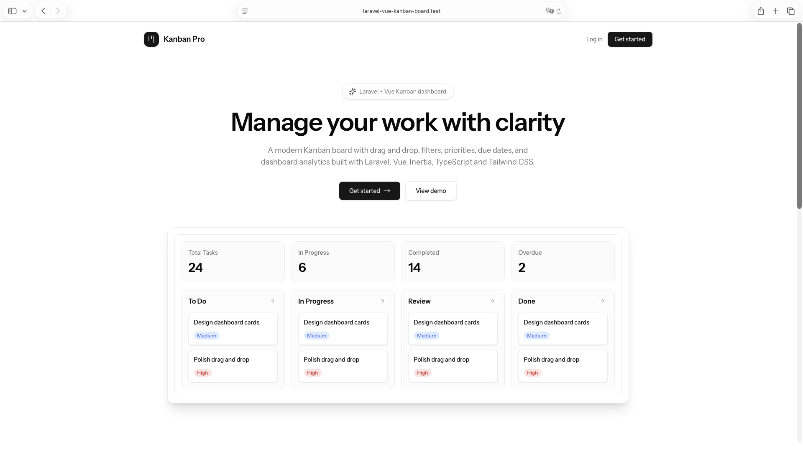
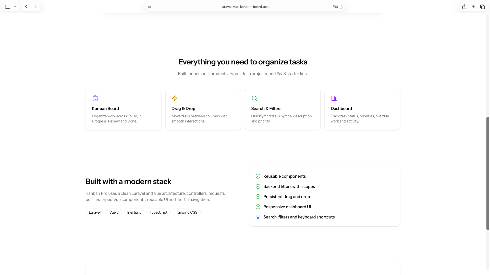
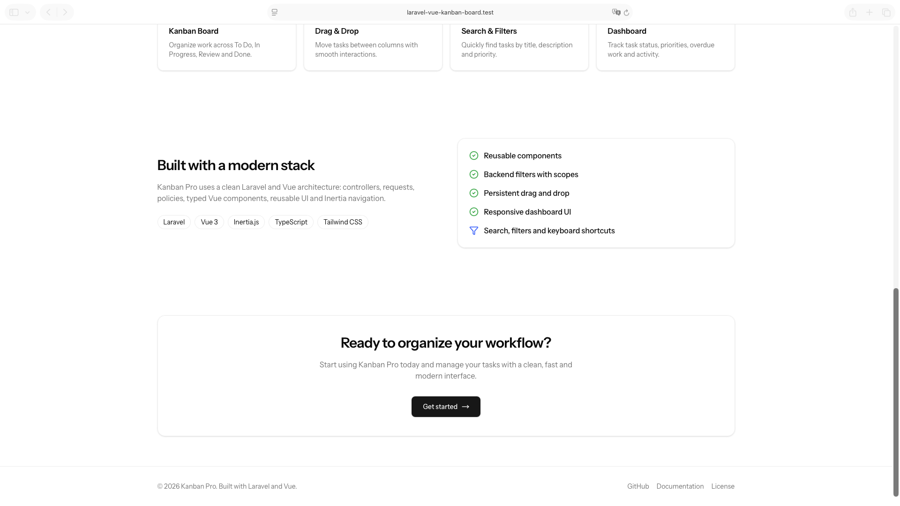
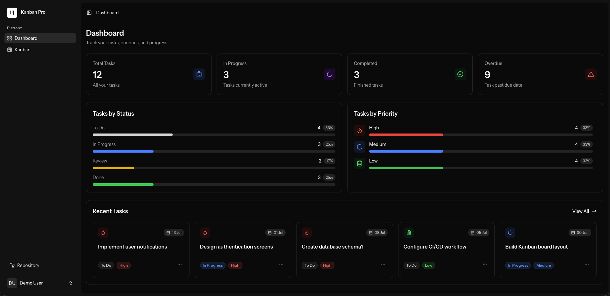
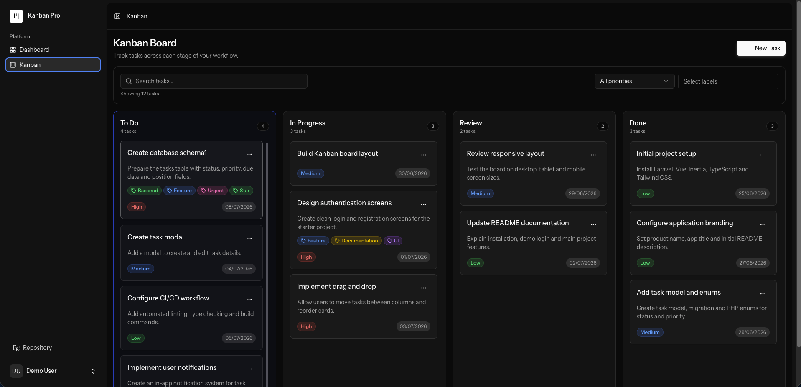
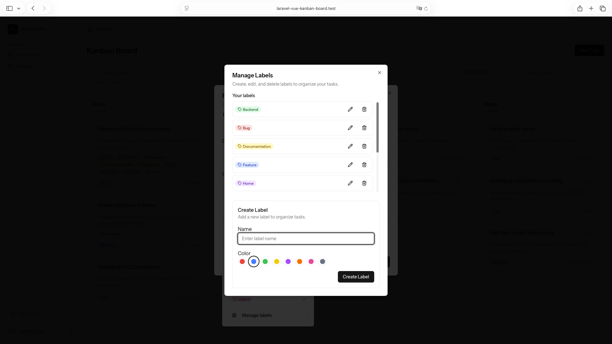
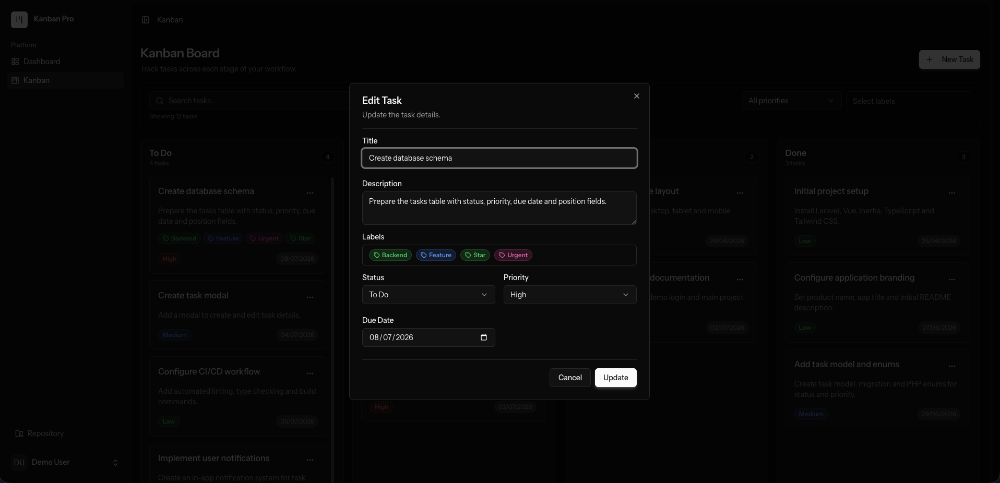
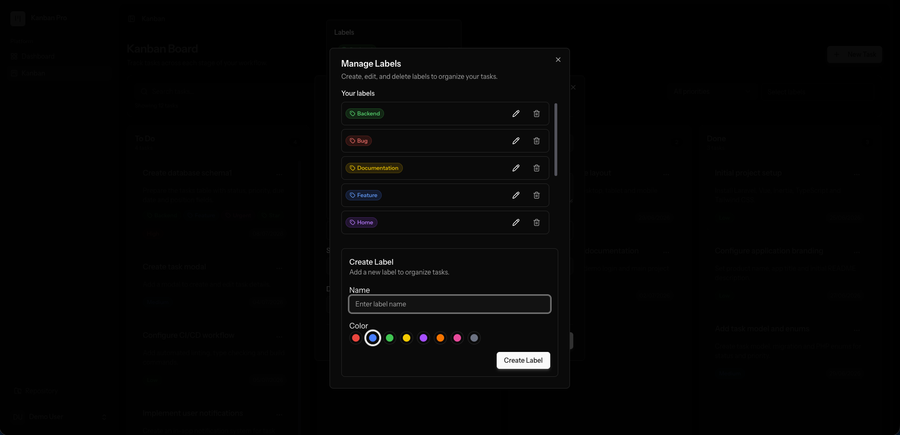

# Laravel Vue Kanban Board

Modern Kanban Board built with Laravel 13, Vue 3, Inertia.js and TypeScript.

Designed with clean architecture, reusable Vue components, modern Laravel best practices, and a polished Light & Dark interface.

> 🚀 A commercial Laravel & Vue Kanban Board built for modern project management applications.

## 🎥 Demo

## 📌 Project Overview

| Feature | Status |
|----------|--------|
| Laravel | 13 |
| Vue | 3 |
| PHP | 8.4 |
| License | Commercial |
| Purchase | Available on Gumroad |

> [!NOTE]
> This repository is a showcase of the project.
>
> The full source code is distributed under a commercial license and is not included in this repository.

## ✨ Features

### 📊 Dashboard

- Responsive design
- Light & Dark themes
- Clean interface
- Smooth drag & drop
- Keyboard shortcuts
- Empty states

### 📋 Kanban Board

- Drag & Drop
- Multiple task statuses
- Task priorities
- Due dates
- Labels
- Label management
- Search tasks
- Filter by priority
- Filter by labels
- Keyboard shortcuts
- Empty states

### ✅ Tasks

- Create, edit and delete tasks
- Rich task details
- Task descriptions
- Reusable dialogs
- Form validation

### 🎨 User Experience

- Responsive design
- Clean interface
- Dark mode *(coming soon)*

### 👨‍💻 Developer Experience

- Laravel 13
- Vue 3
- TypeScript
- Inertia.js
- Shadcn Vue
- Tailwind CSS
- Feature Tests
- Policies
- Form Requests
- Seeders
- Factories

## 📸 Screenshots

### Landing Page

| Hero | Features |
|------|----------|
|  |  |

| Tech Stack |
|------------|
|  |

---

### Application

| Dashboard | Kanban Board |
|------------|--------------|
|  |  |

| Dashboard (Dark) | Kanban Board (Dark) |
|------------------|---------------------|
|  |  |

| Task Details | Label Management |
|--------------|------------------|
|  |  |

| Task Dialog (Dark) | Label Management (Dark) |
|------------------|-----------------------|
|  |  |

## 🛠 Tech Stack

- Laravel 13
- PHP 8.4
- Vue 3
- TypeScript
- Inertia.js
- Tailwind CSS
- Shadcn Vue
- SortableJS
- Pest

## 🗺 Roadmap

- [ ] Projects
- [ ] Comments
- [ ] Checklists
- [ ] File Attachments
- [ ] Notifications
- [ ] Dashboard Charts
- [ ] Team Management
- [ ] Calendar View

## 🛒 Purchase

The full source code is available as a commercial product on Gumroad.

👉 [Buy Laravel Vue Kanban Board]([https://alonacosta.gumroad.com/l/kanban-board])

After purchase, you will receive access to the project source code and setup instructions.

## 📄 License

This repository is provided for showcase purposes only.

The source code is distributed under a commercial license and is not included in this repository.

